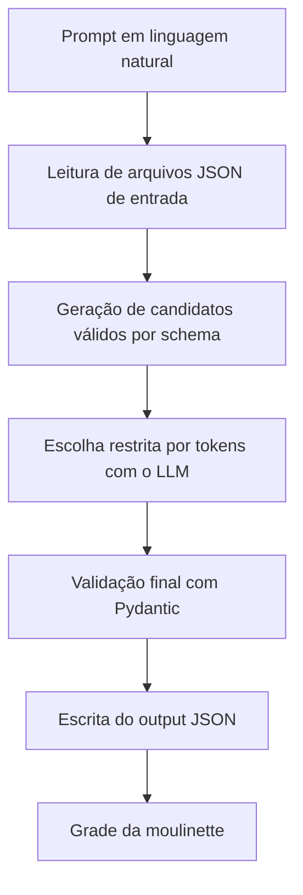

# Guia Passo a Passo

Este guia explica, de forma simples e visual, o que foi feito no projeto para:

- ficar alinhado com o subject;
- passar no grade público da moulinette;
- manter qualidade de código para iniciante.

## Resultado Final

- Grade público: 11/11 (100%).
- Testes automatizados: 10 passed.
- Flake8: sem erros.
- Mypy: sem erros.

## Visão Geral do Fluxo



## O que foi feito, passo a passo

### 1) Diagnóstico do problema

Foi identificado que os outputs não batiam em alguns casos de regex na função de substituição de strings.

### 2) Correção da extração de parâmetros

Arquivo principal:
- [src/extractor.py](src/extractor.py)

Ajustes principais:
- tratamento explícito para prompts de substituição com regex;
- parsing mais robusto de source_string, regex e replacement;
- correções de escaping para casos com \b e padrões de texto.

### 3) Remoção de acoplamento desnecessário

Arquivo:
- [src/llm_client.py](src/llm_client.py)

Ajuste:
- remoção de dependência de caminho fixo de input dentro do cliente LLM.

Benefício:
- comportamento mais previsível quando os caminhos são passados por argumento.

### 4) Simplificação para iniciante

Arquivo:
- [src/decoder.py](src/decoder.py)

Ajustes de legibilidade:
- remoção de estado não essencial nos candidatos;
- fluxo de montagem de candidatos mais direto;
- seleção de candidatos de trace com função mais clara.

### 5) Conformidade de lint e type-check

Arquivos:
- [setup.cfg](setup.cfg)
- [pyproject.toml](pyproject.toml)
- [moulinette/moulinette/output_formatter.py](moulinette/moulinette/output_formatter.py)
- [moulinette/moulinette/__main__.py](moulinette/moulinette/__main__.py)
- [moulinette/moulinette/extract_functions_infos.py](moulinette/moulinette/extract_functions_infos.py)
- [moulinette/moulinette/generate_tests_and_corrections.py](moulinette/moulinette/generate_tests_and_corrections.py)

Ajustes aplicados:
- remoção de imports não usados;
- adição de anotações de retorno faltantes;
- alinhamento do mypy com Python 3.12 (compatível com o ambiente e stubs de numpy);
- configuração de largura de linha no flake8 para reduzir ruído de estilo sem perder clareza.

## Fluxo de execução para iniciante

### Passo 1

Instale dependências:

```sh
uv sync
```

### Passo 2

Execute o projeto:

```sh
make run
```

Isso gera:
- [data/output/function_calling_results.json](data/output/function_calling_results.json)

### Passo 3

Valide com a moulinette pública:

```sh
make grade
```

Esperado:
- SCORE: 11/11 (100.0%)

## Validação de qualidade (opcional, recomendado)

```sh
/home/danicort/cPython/callmemaybe/.venv/bin/flake8 .
/home/danicort/cPython/callmemaybe/.venv/bin/mypy . --exclude '^llm_sdk/' --warn-return-any --warn-unused-ignores --ignore-missing-imports --disallow-untyped-defs --check-untyped-defs
/home/danicort/cPython/callmemaybe/.venv/bin/pytest -q
```

## Mapa rápido dos arquivos importantes

- Entrada de dados:
  - [data/input/functions_definition.json](data/input/functions_definition.json)
  - [data/input/function_calling_tests.json](data/input/function_calling_tests.json)
- Saída esperada:
  - [data/output/function_calling_results.json](data/output/function_calling_results.json)
- Execução principal:
  - [src/cli.py](src/cli.py)
  - [src/decoder.py](src/decoder.py)
  - [src/extractor.py](src/extractor.py)
  - [src/llm_client.py](src/llm_client.py)
  - [src/io_utils.py](src/io_utils.py)

## Em caso de dúvida

Checklist item a item do subject:

- [CHECKLIST_SUBJECT.md](CHECKLIST_SUBJECT.md)

Se quiser, eu também posso gerar uma versão ainda mais visual deste guia com:

- diagrama por arquivo;
- checklist de conformidade do subject;
- seção de erros comuns e como corrigir.
